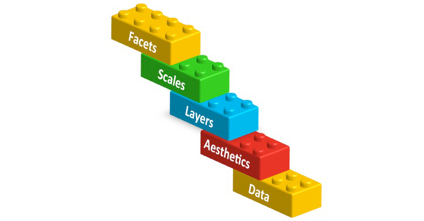

```{r setup, include=FALSE}
library(knitr)
knitr::opts_chunk$set(message=FALSE, warning=FALSE)
```

## Graphics in R

* Vizualising data is extremely important 
    + data checking and understanding
    + very powerful way of describing results in presentations/publications etc

* R can produce journal quality graphs! (superior to Excel, Minitab etc.)

* BUT!!! There is a bit of R code to learn; the grammar of graphics (ggplot2 package)

NB: There are simpler ways to plot things with R, but are much uglier so this is worth the pain!

## Install package and import dataset
+ Install the **ggplot2** package.
+ Run the library function to start using the ggplot2 functions.
+ **ggplot2** is actually part of **tidyverse** so you can just load tidyverse.

```{r}
#install.packages("ggplot2")
library(here)
library(ggplot2)
#OR
library(tidyverse)
```

+ Import a dataset and see what we can do with it in **ggplot2**. 
+ The **"NBA.csv"** dataset contains the **height**, **weight**, **age** and **positions** of NBA players. 

```{r, echo=TRUE, eval = TRUE}
nba <- read_csv(here("data","NBA.csv"))
```

## An example of a plot by ggplot2
Now lets visualize the relationship between the **Weight** and **Height** of NBA players according to their **position**.

```{r, out.width = "250px", echo=FALSE, fig.align='center'}
ggplot(nba, aes(x = Weight, y = Height, colour = Pos)) +
geom_point() +
stat_smooth(method = "lm", se = FALSE) +
scale_colour_brewer(palette="Dark2", 
                    name  ="Player \nPosition",
                    breaks=c("C", "F", "G"),
                    labels=c("Centre", "Forward", "Guard")) +
facet_grid(. ~ Pos) +
labs(x = "Weight (lbs)", 
     y = "Height (in)", 
     title = "Scatterplot of weight and height of \n NBA players by position") + 
theme(axis.title = element_text(colour = "black", size = 14, face = "bold.italic"),
strip.text = element_text(colour = "black", face = "bold.italic", size = 12),
plot.title = element_text(colour = "black", size = 14, face = "bold.italic", hjust = 0.5),
legend.title = element_text(colour="black", size=14, face="bold"),
legend.text = element_text(colour="black", size = 14, face = "bold") )
```

## The code for this plot is the following!! 
\scriptsize
```{r, echo=TRUE, eval=FALSE, size="HUGE"}
ggplot(nba, aes(x = Weight, y = Height, colour = Pos)) +
geom_point() +
stat_smooth(method = "lm", se = FALSE) +
scale_colour_brewer(palette="Dark2", 
                    name  ="Player \nPosition",
                    breaks=c("C", "F", "G"),
                    labels=c("Centre", "Forward", "Guard")) +
facet_grid(. ~ Pos) +
labs(x = "Weight (lbs)", 
     y = "Height (in)", 
     title = "Scatterplot of weight and height of \n NBA players by position") + 
theme(axis.title = element_text(colour = "black", size = 14, face = "bold.italic"),
strip.text = element_text(colour = "black", face = "bold.italic", size = 12),
plot.title = element_text(colour = "black", size = 14, face = "bold.italic", hjust = 0.5),
legend.title = element_text(colour="black", size=14, face="bold"),
legend.text = element_text(colour="black", size = 14, face = "bold") )
```


## The ggplot grammar

* We just need to go through the ggplot grammar step by step.
* ggplots are composed of **building blocks** that are added to the plot one after the other using the **+** sign. 

Here are the most important building blocks. We start building a plot from the bottom!

```{r, out.width = "200px", echo=FALSE, fig.align='center'}
knitr::include_graphics("ggplot_bricks_ALL.jpg")
```


## 1. DATA
```{r, out.width = "250px", echo=FALSE, fig.align='center'}
knitr::include_graphics("ggplot_bricks_1.jpg")
```

Anything you try to plot with ggplot needs to belong to a dataframe. The variables we want to visualize belong to the **NBA** dataset.

\footnotesize
```{r}
head(nba)
```


## 2. Aesthetics mapping
```{r, out.width = "300px", echo=FALSE, fig.align='center'}
knitr::include_graphics("ggplot_bricks_2.jpg")
```

Aesthetics refer to the variables we want to see. In this case **Weight** and **Height**! So let's start building our plot using the **ggplot** function.

## 2. Aesthetics mapping

```{r, out.width = "150px", fig.align='center'}
ggplot(data = nba, aes(x = Weight, y = Height))
```


## 3. Layers
```{r, out.width = "300px", echo=FALSE, fig.align='center'}

```

In order to see something on our plot we need to add layers. Layers include geometric elements (**geoms**) and statistical transformations (**stats**). 

## 3. Layers
Since we want to build a scatterplot our first layer will be a layer of points (geom_point):
\footnotesize
```{r, out.width = "200px", fig.align='center'}
ggplot(data = nba, aes(x = Weight, y = Height)) + 
  geom_point() # Layer 1
```

## 3. Layers
We also want to see the statistical relationship between weight and height so we will add a regression line as our second layer.
\footnotesize
```{r, out.width = "200px", fig.align='center'}
ggplot(data = nba, aes(x = Weight, y = Height)) + 
  geom_point() + # Layer 1
stat_smooth(method = "lm", se = FALSE) # Layer 2
```


## 4. Scales
```{r, out.width = "250px", echo=FALSE, fig.align='center'}
knitr::include_graphics("ggplot_bricks_4.jpg")
```

* Scales map values in the data space to values in an aesthetic space. This can be colour, size or shape.
* Let's colour each point by the player's position using scales.
* This will also automatically create a legend to explain the colours on the plot. 

## 4. Scales
\footnotesize
```{r, out.width = "200px", fig.align='center'}
ggplot(data = nba, aes(x = Weight, y = Height, colour = Pos)) + 
  geom_point() + 
stat_smooth(method = "lm", se = FALSE) + 
scale_colour_brewer(palette="Dark2") 
```
NB: You can obtain a similar plot just by adding a colour variable in the aesthetics. Scales give you the ability to have control over the colours chosen.


## 4. Scales
You can plot the same thing without using scales!
\footnotesize
```{r, out.width = "200px", fig.align='center'}
ggplot(data = nba, aes(x = Weight, y = Height, colour = Pos)) + 
  geom_point() + 
stat_smooth(method = "lm", se = FALSE) 
```


## 5. Facets
```{r, out.width = "300px", echo=FALSE, fig.align='center'}

```

* What if we want to see a separate plot for each player position?
* Using facets we can display our data split by the chosen variable, in this case position. 

## 5. Facets
\footnotesize
```{r, out.width = "200px", fig.align='center'}
ggplot(data = nba, aes(x = Weight, y = Height, colour = Pos)) + 
  geom_point() + 
stat_smooth(method = "lm", se = FALSE) + 
scale_colour_brewer(palette="Dark2") + 
facet_grid(. ~ Pos) # split grid by the variable Pos
```

## 6+7. Themes and other useful tricks!
```{r, out.width = "300px", echo=FALSE, fig.align='center'}
knitr::include_graphics("ggplot_bricks_ALL.jpg")
```

## 6+7. Themes and other useful tricks!
ggplot is very flexible and you can adjust pretty much every aspect of the plot to your preference. In our original plot we had added a plot title using the **labs** function and the **title**, **x** and **y** arguments respectively as shown in the code below.  

We also changed the title and labels of our legend by adding information to **scale** and the facet labels by adding information to **facet**.

Lastly, we used **theme** to change font size, colour and style of many elements of the plot. You can use theme to change pretty much everything you like on your plot. 

## 6+7. Themes and other useful tricks!
* Here is the whole code again! 
* Check handout for some useful websites to understand each building block better!

\scriptsize
```{r, echo=TRUE, eval=FALSE}
ggplot(nba, aes(x = Weight, y = Height, colour = Pos)) +
geom_point() +
stat_smooth(method = "lm", se = FALSE) +
scale_colour_brewer(palette="Dark2", 
                    name  ="Player \nPosition",
                    breaks=c("C", "F", "G"),
                    labels=c("Centre", "Forward", "Guard")) +
facet_grid(. ~ Pos, labeller=labeller(Pos = c("C"="Centre", "F"="Forward", "G"="Guard"))) +
labs(x = "Weight (lbs)", 
     y = "Height (in)", 
     title = "Scatterplot of weight and height of \n NBA players by position") + 
theme(axis.title = element_text(colour = "black", size = 14, face = "bold.italic"),
strip.text = element_text(colour = "black", face = "bold.italic", size = 12),
plot.title = element_text(colour = "black", size = 14, face = "bold.italic", hjust = 0.5),
legend.title = element_text(colour="black", size=14, face="bold"),
legend.text = element_text(colour="black", size = 14, face = "bold") )
```

## Final plot!

```{r, echo=FALSE,out.width = "250px", fig.align='center'}
ggplot(nba, aes(x = Weight, y = Height, colour = Pos)) +
geom_point() +
stat_smooth(method = "lm", se = FALSE) +
scale_colour_brewer(palette="Dark2", 
                    name  ="Player \nPosition",
                    breaks=c("C", "F", "G"),
                    labels=c("Centre", "Forward", "Guard")) +
facet_grid(. ~ Pos, labeller=labeller(Pos = c("C"="Centre", "F"="Forward", 
                                              "G"="Guard"))) +
labs(x = "Weight (lbs)", 
     y = "Height (in)", 
     title = "Scatterplot of weight and height of \n NBA players by position") + 
theme(axis.title = element_text(colour = "black", size = 14, 
                                face = "bold.italic"),
strip.text = element_text(colour = "black", face = "bold.italic", size = 12),
plot.title = element_text(colour = "black", size = 14, face = "bold.italic", 
                          hjust = 0.5),
legend.title = element_text(colour="black", size=14, face="bold"),
legend.text = element_text(colour="black", size = 14, face = "bold") )
```


## Other plot types

+ You can plot pretty much any type of plot you like and you can change that by changing the **geom** type used. 
+ Some of the common ones are below and also in the cheat sheet provided.

\begin{tabular}{l|l}
  geom & description\\
  \hline
  geom\_point & Points, eg. a scatterplot \\
  geom\_line & lines \\
  geom\_ribbon & Ribbons, y range with continuous x \\
  geom\_polygon & Polygon, a filled path \\
  geom\_pointrange & vertical line with point in the middle \\
  geom\_path & connect observations in original order \\
  geom\_histogram & Histograms \\
  geom\_text & Textural annotations \\
  geom\_violin & Violin plots \\
  geom\_map & Polygons from map
\end{tabular}

## Histograms
\footnotesize
```{r, out.width = "200px", fig.align='center'}
p <- ggplot(data=nba, aes(x=Age)) +
      geom_histogram( fill="blue", colour="purple") + 
      labs(title="Histogram of the Age of NBA players", 
           x="Age (years)") +
      theme_bw()
p
```


## Boxplots
\footnotesize
```{r, out.width = "200px", fig.align='center'}
ggplot(data=nba) +
      geom_boxplot(aes(x=Pos, y=Height), fill="lightgrey", 
                   colour="purple") +
      labs(x="Position", 
           y="Height (in)",
           title="Boxplot of Height per Position") + 
      theme_bw()
```


## Boxplots
+ Overlay the raw data as well
+ Jitter to avoid overlap

\footnotesize
```{r, out.width = "150px", fig.align='center'}
ggplot(data=nba) +
geom_boxplot(aes(x=Pos, y=Height), fill="lightgrey", colour="purple") +
geom_jitter(aes(x=Pos, y=Height), colour="blue", size=0.5) + 
labs(x="Position", 
     y="Height (in)",
     title="Boxplot of Height per Position") + 
theme_bw()
```


## Barcharts
\footnotesize
```{r, out.width = "200px", fig.align='center'}
ggplot(data=nba, aes(x=Pos, fill=Age21)) + 
    geom_bar(colour="black", stat="count",
             position=position_dodge(), 
             size=.3) +                       
    scale_fill_discrete(name="Age of player") + 
    labs(x = "Player Position", y = "Number of players", 
         title = "Barchart of player position by Age category") + 
    theme_bw() # Set theme
```


## More info 

* R Cookbook Graphs \newline

* Line plots tutorial \newline

* Bar plots tutorials \newline

* Scatter plots tutorials \newline

* Histograms tutorial \newline

* Boxplots tutorial \newline


## Exercises

 - Ex1. 
Using dataset *mtcars* plot a box-plot of Gross horse power (*hp*) against number of cylinders (*cyl*). Give the plot the title *Boxplot by (Your Name)*. Add the real horse power values using dots coloured by Number of carburetors (*carb*) faceted by Number of forward gears (*gear*). Change the labels of gear to "3 Gears", "4 Gears", "5 Gears".

Hint: To find more info about a R dataset try *?mtcars*.

 - Ex2. 
Using the same dataset plot a stacked bar chart of number of cylinders (*cyl*) by Transmission (*am*). Change colours corresponding to *am* manually to blue for 0 and red for 1. Change the legend labels to Autumatic and Manual and the legend title to Transmission.

Hint: Check the bar plots tutorial websites above for help or GOOGLE!!
      Which scale would allow us to manually change colours?

## Answers - Ex1. 
\footnotesize
```{r, eval=FALSE}
ggplot(data=mtcars) +
geom_boxplot(aes(x=factor(cyl), y=hp), 
             fill="lightgrey", colour="purple") +
geom_jitter(aes(x=factor(cyl), y=hp, 
                colour=factor(carb)), size=0.2) +
facet_grid(.~gear, 
           labeller=labeller(gear = c("3"="3 Gears", "4"="4 Gears", 
                                              "5"="5 Gears"))) +
labs(x = "Number of cylinders)", 
     y = "Gross horse power",
     title = "Boxplot by (Your Name)") + 
theme(plot.title = element_text(hjust = 0.5))
```

## Answers - Ex1. 
\footnotesize
```{r, echo=FALSE, out.width = "250px", fig.align='center'}
ggplot(data=mtcars) +
geom_boxplot(aes(x=factor(cyl), y=hp), 
             fill="lightgrey", colour="purple") +
geom_jitter(aes(x=factor(cyl), y=hp, 
                colour=factor(carb)), size=0.2) +
facet_grid(.~gear, 
           labeller=labeller(gear = c("3"="3 Gears", "4"="4 Gears", 
                                              "5"="5 Gears"))) +
labs(x = "Number of cylinders)", 
     y = "Gross horse power",
     title = "Boxplot by (Your Name)") + 
theme(plot.title = element_text(hjust = 0.5))
```

## Answers - Ex2. 
\footnotesize
```{r, eval=FALSE}
ggplot(data=mtcars) + 
geom_bar(aes(x = cyl, fill = factor(am)),
                           stat= "count") + 
scale_fill_manual(values = c("0" = "blue","1" = "red"),
                         name  ="Transmission",
                         breaks=c("0", "1"),
                         labels=c("Automatic", "Manual")) +
labs(x = "Number of cylinders", 
     y = "Number of cars") 
```

## Answers - Ex2. 
```{r, echo=FALSE, out.width = "250px", fig.align='center'}
ggplot(data=mtcars) + 
geom_bar(aes(x = cyl, fill = factor(am)),
                           stat= "count") + 
scale_fill_manual(values = c("0" = "blue","1" = "red"),
                         name  ="Transmission",
                         breaks=c("0", "1"),
                         labels=c("Automatic", "Manual")) +
labs(x = "Number of cylinders", 
     y = "Number of cars")              
```

